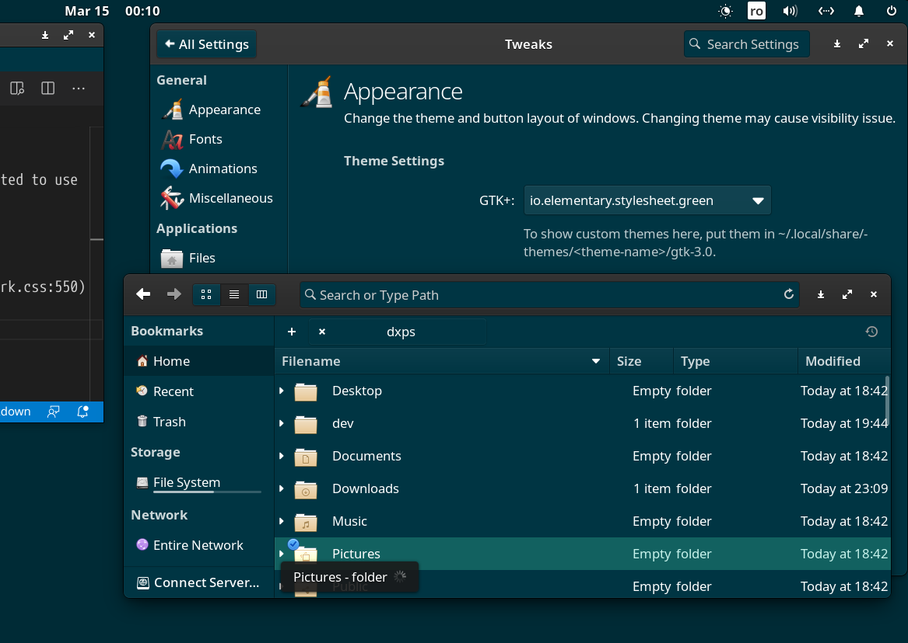

## My green elementaryOS Theme

Based on `io.elementary.stylesheet.mint`, updated to use `#003543` color in a couple of places such as:
- #2a2a2a
- #3a3a3a
- #333
- #404040 (used for check, radio, ... | gtk-dark.css:550)

Not yet managed to update the title bars of the windows.

See the sample below for the current state. Of course, there are more things to improve, such as better contrast.

### Install

The whole repo (directory) needs to be copied into your home dir, under `.local/share/themes/` directory.
